# 🎵 Claude Orchestra

[](https://github.com/BIwashi/claude-orchestra/actions/workflows/ci.yml)
[](https://opensource.org/licenses/MIT)
[](https://nodejs.org)

[日本語](docs/README.ja.md)

Turn multiple Claude Code sessions into a live orchestra. Each session becomes an instrument, and every tool call drives the music.

<p align="center">
  
</p>

## How It Works

```
Claude Code Session A (Piano 🎹)  ──┐
Claude Code Session B (Cello 🎻)  ──┤── Hook Events ──→ Conductor ──→ Audio Output
Claude Code Session C (Flute 🎶)  ──┘
```

- **Session join** → ascending arpeggio (welcome!)
- **Tool use** → note mapped to the tool type (Read=tonic, Bash=dominant, Edit=mediant…)
- **Subagent spawn** → new instrument joins the ensemble
- **Error** → chromatic passing tone
- **Idle** → ambient chord progression with crossfade
- **Session leave** → descending arpeggio (farewell)

The conductor auto-starts when a Claude Code session begins and auto-stops when the last session ends. No manual setup needed.

Claude sees the current track and section status after every tool call — try `/claude-orchestra:status` for details.

## Quick Start

### Prerequisites

- Node.js >= 20
- macOS or Linux
- ffmpeg/ffplay (`brew install ffmpeg` / `apt install ffmpeg`)
- sox (`brew install sox` / `apt install sox`)

### Install as Claude Code Plugin

```bash
claude plugin marketplace add BIwashi/claude-orchestra
claude plugin install claude-orchestra
```

That's it! The plugin hooks auto-start the conductor in synth mode. For the full experience with pre-mixed tracks, say:

```
/orchestra setup
```

Or configure manually:

```bash
npx claude-orchestra config set mode mixer
npx claude-orchestra start --daemon
```

## Modes

| Mode       | Description                                                                   | Dependencies             |
| ---------- | ----------------------------------------------------------------------------- | ------------------------ |
| **mixer**  | Pre-mixes stems with sox, plays with ffplay. Global clock sync. Best quality. | sox, ffplay, track audio |
| **synth**  | Generates tones via ffmpeg harmonic synthesis. Works out of the box.          | ffmpeg only              |
| **sample** | Plays pre-recorded stems directly. Legacy mode, can drift.                    | afplay/paplay/aplay      |

## CLI Reference

```
claude-orchestra help                Show all commands
claude-orchestra start [--daemon]    Start the conductor
claude-orchestra stop                Stop the conductor
claude-orchestra status              Show active sessions, mode, and track

claude-orchestra volume [0.0-1.0]    Get or set volume (live, no restart)

claude-orchestra track list          List available tracks
claude-orchestra track use <name>    Switch to a track
claude-orchestra track add <dir>     Register a track directory

claude-orchestra config show         Show current config
claude-orchestra config set <k> <v>  Update a config value (mode, volume, track)
```

## Volume Control

Adjust volume at runtime — changes apply immediately without restarting:

```bash
npx claude-orchestra volume 0.3    # Quiet background
npx claude-orchestra volume 0.7    # Louder
```

Volume uses file-based signaling (`~/.claude-orchestra/volume-signal`). The conductor polls every 2 seconds and applies the change smoothly.

## Demo Tracks

### Bundled (MIDI → render locally)

| Track              | Composer         | Duration | Mood                       |
| ------------------ | ---------------- | -------- | -------------------------- |
| Ode to Joy         | Beethoven (1824) | ~2 min   | 🎉 Bright, uplifting       |
| Orpheus Underworld | Offenbach (1858) | ~2:40    | 💃 Fast, chaotic (Can-Can) |
| Morning Mood       | Grieg (1875)     | ~3 min   | 🌅 Calm, focused           |
| Polovtsian Dances  | Borodin (1890)   | ~2:30    | 🔥 Powerful, exotic        |
| From the New World | Dvořák (1893)    | ~1:40    | 🌍 Epic, energetic         |

All public domain. MIDI files are bundled; render stems with `/claude-orchestra:setup`.

```bash
npx claude-orchestra track list
npx claude-orchestra track use ode-to-joy
```

## Preparing Custom Tracks

Turn any audio file into a Claude Orchestra track:

```bash
./bin/prepare-track.sh source.mp3 --name my-track --timestamps 0:00,1:30,3:00
```

This separates stems with demucs (when available), slices into sections, and writes `manifest.json` + section audio under `~/.claude-orchestra/tracks/<name>/`.

See [`data/tracks/demo/`](data/tracks/demo/) for the manifest format reference.

### Track Directory Structure

```
~/.claude-orchestra/tracks/my-track/
  manifest.json
  sections/
    00-intro/
      part-0.wav   (strings)
      part-1.wav   (woodwinds)
      part-2.wav   (brass)
    01-theme/
      part-0.wav
      ...
```

### manifest.json Example

```json
{
  "name": "My Track",
  "eventsPerSection": 8,
  "maxParts": 4,
  "sections": [
    {
      "id": "00-intro",
      "name": "Introduction",
      "loop": true,
      "parts": [
        { "file": "sections/00-intro/part-0.wav", "label": "Strings", "volume": 0.7 },
        { "file": "sections/00-intro/part-1.wav", "label": "Woodwinds", "volume": 0.5 }
      ]
    }
  ],
  "idle": { "strategy": "sustain", "fadeMs": 2000 }
}
```

## Plugin Commands & Skills

### Slash Commands

| Command                          | Description                                 |
| -------------------------------- | ------------------------------------------- |
| `/claude-orchestra:status`       | Show current track, section, sessions       |
| `/claude-orchestra:play [track]` | Switch track from within Claude             |
| `/claude-orchestra:setup`        | Guided dependency install & track rendering |

### Natural Language (via `/orchestra` Skill)

| Say this                               | What happens       |
| -------------------------------------- | ------------------ |
| "start music" / "orchestra" / "bgm on" | Setup and start    |
| "stop music" / "quiet"                 | Stop the conductor |
| "play ode to joy" / "新世界にして"     | Switch track       |
| "louder" / "quieter" / "volume 30%"    | Adjust volume      |
| "what's playing" / "status"            | Show current state |
| "switch to synth" / "mixer mode"       | Change engine mode |

### Output Style

Enable the Orchestra output style for musical, expressive responses:

```
/config → Output style → Orchestra
```

## Architecture

```
hooks/                       Plugin hook definitions
  hooks.json                 SessionStart, PostToolUse, SubagentStart/Stop, SessionEnd

bin/
  conductor.js               CLI entrypoint + event loop (the "conductor")
  hook-lifecycle.sh           Session lifecycle hook (<5ms, auto-creates config)
  hook-musician.sh            Tool event hook (<5ms, atomic write + status output)
  prepare-track.sh            demucs + ffmpeg pipeline for custom tracks

commands/                    Slash commands for in-Claude interaction
  status.md                  /claude-orchestra:status
  play.md                    /claude-orchestra:play [track]

output-styles/               Custom output styles
  orchestra.md               Musical, expressive response formatting

lib/
  engine.js                  Factory: config → MixerEngine | SynthEngine | SampleEngine
  mixer-engine.js            sox pre-mix + ffplay synchronized playback with global clock
  synth-engine.js            Harmonic synthesis via ffmpeg WAV generation
  sample-engine.js           Direct stem playback (legacy)
  base-engine.js             Shared interface: init, setVolume, applyVolume, handleToolEvent, etc.
  playback.js                Cross-platform player detection (ffplay → afplay → paplay → aplay)
  volume-signal.js           File-based runtime volume control
  cli-format.js              ANSI colors, box drawing, progress bars (zero deps)
  audio-player.js            Per-instrument voice channels with rate limiting
  music-theory.js            Scales, progressions, tool→note mappings
  activity-mapper.js         Tool events → musical parameters
  event-watcher.js           Filesystem watcher for event JSON files
  registry.js                Session → instrument assignment with persistence
  tone-cache.js              Tone generation and disk caching

skills/orchestra/            /orchestra skill for natural language control
data/instruments.json        Instrument definitions (harmonics, attack, decay, color)
data/tracks/                 Bundled MIDI + track manifests
```

## Config

Stored at `~/.claude-orchestra/config.json`:

```json
{
  "mode": "mixer",
  "track": "ode-to-joy",
  "volume": 0.5
}
```

## Cross-Platform Support

| OS      | Status           | Player                |
| ------- | ---------------- | --------------------- |
| macOS   | ✅ Full          | ffplay, afplay        |
| Linux   | ✅ Full          | ffplay, paplay, aplay |
| Windows | ❌ Not supported | —                     |

## License

MIT — see [LICENSE](LICENSE)
